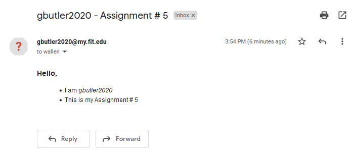

# CSE3231 Assignment # 5
Grant Butler | gbutler2020@my.fit.edu

Hello there! This assignment was pretty straight forward.

I used this function, `send_email` to send emails:

```py
def send_email(host, port, address, body):
    # the different sends
    # ehlo = 'EHLO gbutler2020'
    mail_from = 'MAIL FROM:<gbutler2020@my.fit.edu>\r\n'
    rcpt_to = f'RCPT TO:<{address}>\r\n'
    data = "DATA\r\n"
    message = f'{body}'
    quit = "QUIT\r\n"

    with socket.socket(socket.AF_INET, socket.SOCK_STREAM) as sock:
        sock.connect((host, port))
        resp = sock.recv(4096)
        print(repr(resp))

        # mail_from
        sock.send(mail_from.encode())

        # rcpt_to
        sock.send(rcpt_to.encode())

        # data
        sock.send(data.encode())

        # message
        sock.send(message.encode())

        # quit
        sock.send(quit.encode())
        resp = sock.recv(4096)
        print(repr(resp))
```

Then, in my `main`:
```py
def main():
    host = '0.cloud.chals.io'
    port = 32907

    body = 'Subject: gbutler2020 - Assignment # 5\r\nFrom: gbutler2020@my.fit.edu\r\n'
    'To: wallen@fit.edu\r\nContent-Type: text/html\r\n'
    '<h3>Hello,</h3><ul><li>I am <em>gbutler2020</em></li><li>This is my Assignment # 5</li><ul>\r\n.\r\n'

    address = 'wallen@fit.edu'
    # address = 'gbutler2020@my.fit.edu'

    send_email(host, port, address, body)


main()
```

and running the code this is the output:

```bash
cse3231/5_more_tcp_programming/src on  trunk via 🐍 v3.10.4 (5_more_tcp_programming)
❯ python smtp_email.py
b'220 0.cloud.chals.io ESMTP\r\n'
b'250 2.1.0 Ok\r\n'
```

This is what I got when I tested it on my own email:


Thank you for reading. I really enjoyed this class a ton!!!
