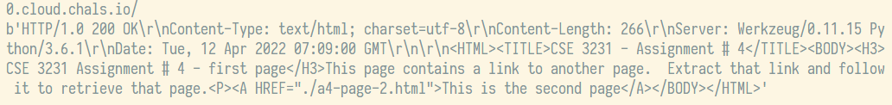

### Assignment 4 - TCP Programming
For this assignment, you will make a TCP connection to a web server to retrieve two different HTML pages and display the text of those pages on the screen.  You do not have to render them as web pages, just display the text you receive. For this assignment, you have a choice of C/C++, Java or Python.  However, for both parts, the connection to the web server must be made using the language's socket API, not a specialized class library or API (like Python's HTTP.client or Java's HttpClient). You can use any method to parse the text to find the second URL (substring search, find(), etc.).

There are two parts to the assignment and each one will be graded separately, so if you only get the first part working, you will get credit for that part.  However, Part 1 must be completed to do Part 2 since Part 1 gives you the information you need for Part 2.

##### Part 1:
Make a TCP connection to port **23456** of the server at http://0.cloud.chals.io
Sent a properly formatted HTTP header (see the slides) to retrieve the default webpage at that location.
Receive and display the text of the HTML document the server sends as a reply

>If you receive nothing, an error message or an incomplete HTML document,
>your request may not have been formatted correctly

##### Part 2:
The HTML document you received in Part 1 contains the URL for another webpage and your program must extract that URL and send a second request to the same web server to retrieve that new web page.
When you receive the new page, display it on the screen.

For both parts, **submit your source code and a screenshot showing the results when you run that program.**

Writeup:

## CSE3231 Assignment 4 - TCP Programming
Grant Butler | e. [gbutler2020@my.fit.edu](mailto:gbutler2020@my.fit.edu)

##### Part I:
The code in `get_html(host, port, page)` retrieves the html from the server:
```py {.line-numbers}
def get_html(host, port, page):
    request = f'GET {page} HTTP/1.1\r\n{host}\r\n\r\n'

    # open the socket as TCP → SOCK_STREAM since TCP connects a data stream
    with socket.socket(socket.AF_INET, socket.SOCK_STREAM) as sock:
        sock.connect((host, port))  # connect to the server
        sock.send(request.encode())  # send the request to the server
        response = sock.recv(4096)  # get response from server
        html = repr(response)  # get html doc text from response data

    return html
```

Then, in `main` the function is called and the html is printed out:
```py {.line-numbers}
def main():
    host = '0.cloud.chals.io'
    port = 23456

    main_page = '/'
    main_html = get_html(host, port, main_page)
    print(host + main_page)
    print(main_html, end='\n\n')  # part 1 done
```

This is what gets printed out:

... not very pretty. Oh well, such is life.
<div style="page-break-after: always; break-after: page;"></div>

##### Part II:
For this part, we can use something super cool about html to our advantage!
```html
<A HREF="./a4-page-2.html">This is the second page</A>
```
The part `HREF` always is followed by a link! And since there is only one link, and I don't have access to something like `lxml` or `bs4`, I will be using regular expressions. So, I made this `HREF="(?:[^"]|"")*"`. A bit of substring magic and boom! Link.

Then, I simply call this:
```py {.line-numbers}
# now to parse the other link
link_regex = re.compile(r'HREF="(?:[^"]|"")*"')  # regex for the href
href_str = link_regex.search(main_html).group()  # getting the link

# substring magic
sub_page = f'{href_str[7:-1]}'
sub_html = get_html(host, port, sub_page)
print(host + sub_page)
print(sub_html, end='\n\n')  # part 2 done
```

This is the resultant response:


And I believe that is it! Thank you for reading, I appreciate you. The following is my code and the total execution of all parts at once:
<div style="page-break-after: always; break-after: page;"></div>

##### program:
```py {.line-numbers}
import socket
import re


def get_html(host, port, page):
    request = f'GET {page} HTTP/1.1\r\n{host}\r\n\r\n'

    # open the socket as TCP → SOCK_STREAM since TCP connects a data stream
    with socket.socket(socket.AF_INET, socket.SOCK_STREAM) as sock:
        sock.connect((host, port))  # connect to the server
        sock.send(request.encode())  # send the request to the server
        response = sock.recv(4096)  # get response from server
        html = repr(response)  # get html doc text from response data

    return html


def main():
    host = '0.cloud.chals.io'
    port = 23456

    main_page = '/'
    main_html = get_html(host, port, main_page)
    print(host + main_page)
    print(main_html, end='\n\n')  # part 1 done

    # now to parse the other link
    link_regex = re.compile(r'HREF="(?:[^"]|"")*"')  # regex for the href
    href_str = link_regex.search(main_html).group()  # getting the link

    # substring magic
    sub_page = f'{href_str[7:-1]}'
    sub_html = get_html(host, port, sub_page)
    print(host + sub_page)
    print(sub_html, end='\n\n')  # part 2 done


main()

```
<div style="page-break-after: always; break-after: page;"></div>

##### output:
```sh {.line-numbers}
cse3231assignments/assignment4_tcp_programming/src on  trunk via 🐍 v3.10.4 (cse3231assignment4)
❯ python tcp_programming.py
0.cloud.chals.io/
b'HTTP/1.0 200 OK\r\nContent-Type: text/html; charset=utf-8\r\nContent-Length: 266\r\nServer: Werkzeug/0.11.15 Python/3.6.1\r\nDate: Tue, 12 Apr 2022 02:45:06 GMT\r\n\r\n<HTML><TITLE>CSE 3231 - Assignment # 4</TITLE><BODY><H3>CSE 3231 Assignment # 4 - first page</H3>This page contains a link to another page.  Extract that link and follow it to retrieve that page.<P><A HREF="./a4-page-2.html">This is the second page</A></BODY></HTML>'

0.cloud.chals.io/a4-page-2.html
b'HTTP/1.0 200 OK\r\nContent-Type: text/html; charset=utf-8\r\nContent-Length: 159\r\nServer: Werkzeug/0.11.15 Python/3.6.1\r\nDate: Tue, 12 Apr 2022 02:45:07 GMT\r\n\r\n<HTML><TITLE>CSE 3231 - Assignment # 4</TITLE><BODY><H3>CSE 3231 Assignment # 4 - second page</H3>You have successfully accessed the second page.</BODY></HTML>'
```
