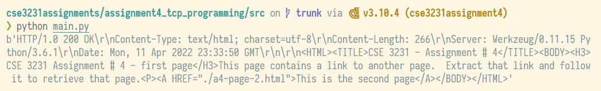

## CSE3231 Assignment 4 - TCP Programming
Grant Butler | e. [gbutler2020@my.fit.edu](mailto:gbutler2020@my.fit.edu)

##### Part I:
The code in `get_html(host, port)` retrieves the html from the server:
```py
def get_html(host, port):
    request = f'GET / HTTP/1.1\r\n{host}\r\n\r\n'

    # open the socket as TCP → SOCK_STREAM since TCP connects a data stream
    with socket.socket(socket.AF_INET, socket.SOCK_STREAM) as sock:
        sock.connect((host, port))  # connect to the server
        sock.send(request.encode())  # send the request to the server
        response = sock.recv(4096)  # get response from server
        html = repr(response)  # get html doc text from response data

    return html
```

Then, in `main` the function is called and the html is printed out:
```py
def main():
    host = '0.cloud.chals.io'
    port = 23456

    original_html = get_html(host, port)
    print(original_html)
```

This is what gets printed out:

... not very pretty. Oh well, such is life.

##### Part II:
For this part, we can use something super cool about html to our advantage!
```html
<A HREF="./a4-page-2.html">This is the second page</A>
```
The part `HREF` always is followed by a link! And since there is only one link, and I don't have access to something like `lxml` or `bs4`, I will be using regular expressions. So, I went to [regexr.com](regexr.com) (not sponsored) and plugged in `HREF="./a4-page-2.html"` and used this `HREF="(?:[^"]|"")*"`. A bit of substring magic and boom! Link.
