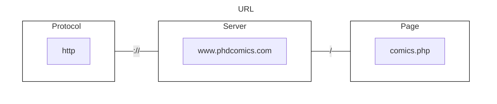
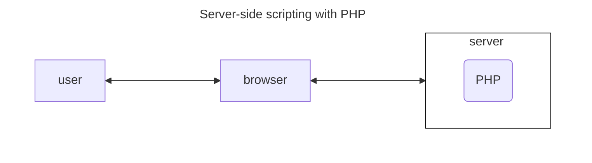
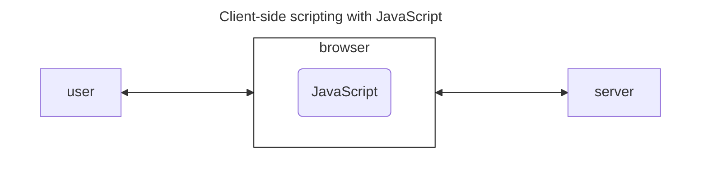

<div class="title-page">

# CSE3231 Final Exam Study Guide
### Grant Butler, Tyler Zars
#### gbutler2020@my.fit.edu | tzars2019@my.fit.edu
</div>
<div style="page-break-after: always; break-after: page;"></div>


<!---
Table Of Contents
--->
<div class="center">

# Table of Contents
</div>

<a id="tableRet">Sections</a>

[Transport Layer](#tl1)


<div style="page-break-after: always; break-after: page;"></div>

<div style="text-align: center;">

## Transport Layer
</div>

### <a id="tl1">UDP and TCP</a>
Differences:

<div class="leftColumn">

<div style="text-align: center;">

#### TCP (Transport Control Protocol)
</div>

Advantages
- Connection oriented transport
  - Sender must establish connection before transmission
  - Sender notified of delivery or of error
- <span class="textPink">Byte-stream</span> service
  - Data transmission and reception are similar to file I/O
- Reliable delivery
  - Garuntees packets are assembled <span class="textPink">in order</span>

Connection Management
- Connection
  - Three way connection increases probability that both endpoints know that connection was acccepted.
- Termination
  - Four way handshake requires two FIN and two ACK to complete. Ensures proper termination of connection occurs.

</div>

<div class="rightColumn">
<div style="text-align: center;">

#### UDP (User Datagram Protocol)
</div>

- Connectionless
  - Destination address and port number are added to transport segment's header and the segment is sent to the destination.
  - No confirmation of error or delivery (ACK) is returned.
    - Unreliable because of no ACK
- Advantages
  - Applications pass **<span class="textPink">directly</span>** to transport layer.
  - Data is transmitted _<span class="textPink">immediately</span>_. Will either reach the receiver or not at all.
  - Less to manage:
    - No _<span class="textPink">congestion-control</span>_ or retransmission mechanisms.
    - No Connection Establishment
    - No connection state
    - Results in small packet header
  - Messages can be sent in <span class="textPink">broadcast</span> or <span class="textPink">multicast</span> mode.
    - one to multiple receivers (multicast) or all nodes (broadcast)

</div>

<div style="page-break-after: always; break-after: page;"></div>

#### TCP Header Fields
|                     Field                      | <a id="sizeRet">[Size](#size)</a> (bits) |                                                                      Description                                                                      |
|:----------------------------------------------:|:---------------:|:-----------------------------------------------------------------------------------------------------------------------------------------------------:|
|                  Source Port                   |       16        |                                                   Identifies source port number (sender's TCP port)                                                   |
|                Destination Port                |       16        |                                                 Identifies destination port number (receiving port )                                                  |
|                Sequence Number                 |       32        |                                Used to number TCP segments. If SYN = 0, each byte is assigned a sequence number. <sup><a id="seqRet">[*](#seq)</a></sup>                                 |
|             Acknowledgement Number             |       32        |                                           Indicates next sequence number that sending device is expecting.                                            |
|             Offset (Header Length)             |        4        |                                  Shows number of 32 bit words in header. Minimum size of 5 words (`0101` in binary).                                  |
|                    Reserved                    |      4 (6)      |                                                                   Always set to 0.                                                                    |
| <a id="tcpflagsRet">[TCP Flags](#tcpflags)</a> |        8        |                                                        Flags are: URG, ACK, PSH, RST, SYN, FIN                                                        |
|                     Window                     |       16        | The size of the receive window, which is the number of bytes beyond sequence number in Acknowledgement field that the receiver is willing to receive. |
|                    Checksum                    |       16        |                                                      Used for error checking of header and data.                                                      |
|                 Urgent Pointer                 |       16        |                                    Shows the end of urgent data so interrupted data streams can be continued. <sup><a id="urgRet">[+](#urg)</a></sup>                                    |
|                  TCP Options                   |    variable     |        0 → End of Options List, 1 → No Operations (NOP, Pad), 2 → Maximum segment size, 3 → Window Scale, 4 → Selective ACK ok, 8 → Timestamp         |


<div class="footnote">
<sub>

- - -
<a id="size">[Size](#sizeRet)</a>: 4 bits → nibble, 8 bits → byte, 32 bits → word
<a id="seq">[Sequence Number](#seqRet)</a>: If SYN = 1, then this is the initial sequence number. The sequence number of the first byte of data will then be this number + 1. _i.e._: Let first byte of data have this be 300. Then if a packet has 10 bytes, then the next packet sent will have a sequence number of `300 + 10 + 1 = 311`.
<a id="urg">[Urgent Pointer](#urgRet)</a>: When URG is set, the data is given priority.
</sub>
</div>
<div style="page-break-after: always; break-after: page;"></div>

#### <a id="tcpflags">[TCP Flags Explained](#tcpflagsRet)</a>
| Flag |                                                                                         Description                                                                                         |
|:----:|:-------------------------------------------------------------------------------------------------------------------------------------------------------------------------------------------:|
| URG  |                                                                                       Urgent Pointer.                                                                                       |
| ACK  |                                                                                       Acknowledgement                                                                                       |
| PSH  |                                                 Push function. TCP allows an application to specify that data is to be pushed immediately.                                                  |
| RST  | Reset connection. Receiver must respond immediately terminating the connection. Transfer of data ceases, so data in transit is lost. Used for abnormal close of TCP connection, unlike FIN. |
| SYN  |                                                        Indicates synchronized sequence numbers. Source is beginning a new sequence.                                                         |
| FIN  |                                             Set when no more data is to come from sender. Used for good closing of TCP connection, unlike RST.                                              |


<div style="page-break-after: always; break-after: page;"></div>

## TCP Flow Control

TCP needs to control amount of data a sender transmits to avoid overwhelming the receiver.

<div style="text-align: center;">

### Congestion Control vs Flow Control
</div>

<div class="leftColumn">

#### Congestion Control
- focuses on preventing too much data in <span class="textPink">network</span>.
- uses Retransmission Timeout (RTO) and Round Trip Time (RTT)
  - RTT is different for each path a packet takes.
- A router might only be able to handle 100 Mb/s total, but two senders could send more than that.
</div>

<div class="rightColumn">

#### Flow Control
- Tries to prevent senders from overrunning <span class="textPink">capacity of receivers</span>.
  - Can't prevent congestion at routers.
- Uses sliding window to control traffic in transit.
  - Uses <span class="textPink">AdvertisedWindow</span> to indicate how much data it can handle.
  - Measures in bytes, not packets.
  - Limits how many unacknowledged bytes can be in transit at a time.
  - TCP vs Data-Link Sliding Windows
    - Data-Link layer controls transmission of frames over links between adjacent nodes.
      - one sender at a time
      - always arrive in order sent (unless frames are lost)
    - TCP deals with end-to-end flow
      - each receiver can have multiple senders
      - each packet can follow a different path
  - Header uses these fields to manage flow control:
    - _<span class="textPink">SequenceNum</span>_
    - _<span class="textPink">Acknowledgement</span>_
    - _<span class="textPink">AdvertisedWindow</span>_
</div>

<div style="page-break-after: always; break-after: page;"></div>

### TCP Congestion Control: Additive Increase and Multiplicative Decrease (AIMD)

TCP Source sets the CongestionWindow based on level of congestion it _perceives_ in the network.
- Involves <span class="textPink">decreasing</span> congestion window when congestion goes up and <span class="textGreen">increasing</span> the congestion window when level of congestion goes down.
- This is called _<span class="textPink">Additive Increase / Multiplicative Decrease</span>_ (AIMD).

#### Additive Increase
- Every successful send from source that is a _CongestionWindow_'s worth of packets adds the equivalent of 1 to CongestionWindow.
  - Success is measured as one ACK per RTT.
- Increase is slower than decrease and avoids too rapid an increase in transmission rate.

#### Multiplicative Decrease
- Easier to understand in terms of packets, despite <span class="textPink">CongestionWindow</span> being measured in bytes.
  - _e.g.:_
    - CongestionWindow is 16 packets
    - If a loss is detected, CongestionWindow is set to 8.
    - Additional losses go → 4, 2, 1.

#### Slow Start
1. Source starts _CongestionWindow_ at one packet.
2. Sends one packet.
2. ACK arrives → _CongestionWindow_ += 1.
3. Two packets are sent.
4. Two ACKs → _CongestionWindow_ += 2.

Trend: TCP effectively **doubles** every RTT.

1. **Slow Start** begins by doubling _CongestionWindow_ size.
2. When threshold is reached, switches to _additive increase_.
3. When packet is lost, _CongestionWindow_ goes to 1 and slow start repeats.

<div style="page-break-after: always; break-after: page;"></div>

### TCP Timeout and RTT

#### Timeout
Timeout period must be long enough to allow longer paths. If a packet is lost, multiple packets can be sent out before timeout expires. Receiver can't ACK because missing packet caused a gap in _SequenceNum_. Sender can reach _CongestionWindow_ limit while waiting for timeout.

**Fast Retransmission and _Duplicate Acknowledgements_**
Receiver sends ACK for later packets, but with ACK number of last packet before lost packet--_i.e._ <span class="textPink">duplicate acknowledgements</span>.
- Tells sender that at least one packet hasn't arrived, but later ACK's indicate some later packets arrived.
- Duplicate ACK number tells sender which packet wasn't received.

Sender can _resend_ missing packet without waiting for timeout to expire. This is called _fast retransmission_ and can trigger transmission of lost packets sooner than regular timeout.
- Not triggered until _<span class="textPink">three duplicate ACK's</span>_ arrive.
- Sender knows packed was lost, and halves _slow start threshold_ and goes into slow start.

Fast Recovery
- Lost packed decreases _CongestionWindow_ to one and starts slow start.
- Fast retransmission signals congestion, and instead of lower _CongestionWindow_, fast recovery uses ACKs in transit to trigger sending of new packets.
- Removes slow start phase when fast retransmit detects lost packet.

<div style="page-break-after: always; break-after: page;"></div>

#### Round Trip Time (RTT)
Retransmission TimeOut (RTO) is based on <span class="textPink">Round Trip Time</span> (RTT) for a given connection.
- At connection, sender and receiver determine RTT and sender uses that for RTO.
- Sender calulates an average RTT to deal with delays.

Determining RTT:
- Sender and receiver both need RTT, so they put timestamps in options field to track send and receive times.
- A _Smoothed RTT_ (SRTT) is calculated based on the SRTT averaged over time and the most recent RTT.
<div class="center">

$SRTT = \alpha*SRTT + (1 - \alpha)RTT$ where $\alpha = 0.9$
</div>

- Smoothed RTT calculation was revised to include _variance_ in RTT.
  - **Variance** measures how much RTT changes over time.
<div class="center">

$VarRTT = \beta * VarRTT + (1 - \beta) * |SRTT - RTT|$ where $\beta = 0.75$
</div>

- Retransmission TimeOut (RTO) is calculated as follows:
<div class="center">

$RTO = SRTT + 4$<sup>++</sup> $*\ VarRTT$
</div>

<sub>++(multiplying by 4 is based on experimentation)</sub>

<div style="page-break-after: always; break-after: page;"></div>

#### IP Checksum
Header Checksum: 16 bits
- A checksum on the header only. Since some header fields change, it is _<span class="textPink">recomputed</span>_ and verified each time the header is processed.
- Algorithm:
  - 16 bit one's complement of the one's complement sum of all 16 bit words in the header. The value of the checksum field is zero.

IP Checksum Example:
1. break sequence into 16-bit words
2. Add 16-bit values. Each carry-out produced is added to the LSb.
3. Invert all bits to get one's complement.

Header to check:
<div class="center">

$$
\begin{aligned}
&1000\ 0110\ 0101\ 1110\\
&1010\ 1100\ 0110\ 0000\\
&0111\ 0001\ 0010\ 1010\\
&1000\ 0001\ 1011\ 0101\\
\end{aligned}
$$
</div>

<div style="page-break-after: always; break-after: page;"></div>

Add 16-bit values 2 at a time and convert to one's complement:
<div class="center">

$$
\begin{aligned}
&1000\ 0110\ 0101\ 1110 && first\ val\\
+\ &1010\ 1100\ 0110\ 0000 && second\ val\\
\overline{\ \ }&\overline{\ \ \ \ \ \ \ \ \ \ \ \ \ \ \ \ \ \ \ }\\
1\ &0011\ 0010\ 1011\ 1110 && carry-out\\
+\ &0000\ 0000\ 0000\ 0001 && add\ to\ LSb\\
\overline{\ \ }&\overline{\ \ \ \ \ \ \ \ \ \ \ \ \ \ \ \ \ \ \ }\\
&0011\ 0010\ 11011\ 1111\\
+\ &0111\ 0001\ 0010\ 1010 && third\ val\\
\overline{\ \ }&\overline{\ \ \ \ \ \ \ \ \ \ \ \ \ \ \ \ \ \ \ }\\
0\ &1010\ 0011\ 1110\ 1001 && no\ carry-out\\
+\ &1000\ 0001\ 1011\ 0101 && fourth\ val\\
\overline{\ \ }&\overline{\ \ \ \ \ \ \ \ \ \ \ \ \ \ \ \ \ \ \ }\\
1\ &0010\ 0101\ 1001\ 1110 && carry-out\\
+\ &0000\ 0000\ 0000\ 0001 && add\ to\ LSb\\
\overline{\ \ }&\overline{\ \ \ \ \ \ \ \ \ \ \ \ \ \ \ \ \ \ \ }\\
&0010\ 0101\ 1001\ 1111 && one's\ complement\ sum\\
&&& flip\ bits\\
&1101\ 1010\ 0110\ 0000 && one's\ complement\\
\end{aligned}
$$
</div>

Thus, the 16 bit checksum is `1101 1010 0110 0000`.

<div style="page-break-after: always; break-after: page;"></div>

## Applications

Application layer interfaces with transport layer, isolating applications from the details of packet delivery. Applications can use either UDP or TCP. Some use UDP but add features like acknowledgements on their own to get reliable delivery without TCP's overhead.

### Protocols

Usually, an application that supports interaction and data transfer have a _protocol_ for communication between nodes. One may be a _server_, collecting and delivering data, while another may be a client, requesting and providing data. Application Protocols describe how endpoints will interact to accomplish tasks.

#### Internet RFC (Request For Comment)
A set of application protocols that standardize actions across vendors. Examples include:
- Simple Mail Transfer Protocol (SMTP) _<span class="textPink">RFC 5321</span>_
- Hypertext Transfer Protocol (HTTP) _<span class="textPink">RFC 2616/7540</span>_
- File Transfer Protocol (FTP) _<span class="textPink">RFC 959</span>_

Clear application protocols allow developers to create servers and clients that interact in established and predictable ways.
- Some inconsistencies happen when features are added that are <span class="textPink">not part of the protocol</span>.

##### Port Numbers
Servers typically listen on well known ports for connections. A range of UDP and TCP ports are assigned to specific protocols, while others are not reserved.
- <ins>Ports 0-1023</ins> are reserved by the <span class="textPink">Internet Assigned Numbers Authority</span> (IANA).

<div style="page-break-after: always; break-after: page;"></div>

Common ports and their services:
<div class="center">

|            Service             |    Port    |
|:------------------------------:|:----------:|
|              SSH               |     22     |
|              HTTP              |     80     |
|  NTP (Network Time Protocol)   |    123     |
|          IMAP (email)          | 143 or 220 |
| LDAP (authentication protocol) |    289     |
|     HTTPS (using TLS/SSL)      |    443     |
</div>

#### Request/Reply Protocols
Messages are transmitted by client and server to manage and exchange data. Often consist of text commands.
- _<span class="textPink">Stateful</span>_ protocols require client and server to keep track of current state of exchange.
- _<span class="textPink">Stateless</span>_ protocols might have a server not keep a record of exchanges and close connection after each message.

#### Publish-Subscribe Protocol (PubSub)
- **Publishers** make data available for _subscribers_ who register to receive types of messages.
  - _Loosely coupled_ to subscribers and produce whether or not it is used.
  - Has better scalability because publishers don't manage connections.

Examples:
- Apache Kafka
- Google Cloud Pub/Sub
- Data Distribution Service (DDS)

#### Message Queueing
Similar to PubSub, these protocols don't require servers to wait for a client to request. Important aspects include:
- A _<span class="textPink">queue manager</span>_ is implemented and announced to users.
- Applications _register_ to be notified when messages arrive, and then can download those when ready.
- Applications can add messages to a queue.
- Queueing _decouples_ senders and receivers, so senders don't wait before they add to the queue.

Examples:
- Apache ActiveMQ
- Microsoft Message Queueing
- Java Message Service

#### Peer to Peer
Each node can exchange messages with any other node.
- a node can be a client **and** a server
- data is _decentralized_ and passed between peers
- not all nodes have same capabilities, so some may perform special tasks to help other nodes
- peer networks can be _structured_ with set topology or _unstructured_ and allow rapid changes to adapt

Examples:
- Bitcoin and other Cryptocurrency
- BitTorrent
- Gnutella

<div style="page-break-after: always; break-after: page;"></div>

#### HyperText Transfer Protocol (HTTP)
Used for connections between clients (browsers) and servers in the World Wide Web. Provides request/response interaction between server and multiple clients.
- Web browser acts as _<span class="textPink">User Agent</span>_
- Communications are based on TCP
- _Stateless_ protocol
  - <span class="textPink">keep-alive</span> feature was added in v1.1
  - retaining state information was solved with variables in messages or <span class="textPink">web cookies</span> on client's host

Messages:
```plain {.line-numbers}
START_LINE <CRLF>
MESSAGE_HEADER <CRLF>
<CRLF>
MESSAGE_BODY <CRLF>
```
`START_LINE` indicates request or response message. Each section ends with CRLF.

##### Cookies
Coockies are used to support _stateful_ client/server interactions
- server sends cookies (state) with response
- client stores them locally
  - client sends cookie with a new request to the server
- server extracts state information from cookie

Examples:
<div class="center">

|     Domain      | Path |           Content            |    Expires     | Secure |
| --------------- | ---- | ---------------------------- | -------------- | ------ |
| toms-casino.com |  /   |     CustomerID=297793521     | 15-10-10 17:00 |  Yes   |
| jills-store.com |  /   | Cart=1-00501;1-07031;2-13721 | 11-1-11 14:22  |   No   |
|   aportal.com   |  /   | Prefs=Stk:CSCO+ORCL;Spt:Jets | 31-13-20 23:59 |   No   |
|   sneaky.com    |  /   |      UserID=4627239101       | 31-12-19 23:59 |   No   |
</div>

<div style="page-break-after: always; break-after: page;"></div>

##### URLs
Identification of servers and hyperlinks is based on _<span class="textPink">Uniform Resource Locators</span>_ (URLs), which contain information to access a target server and document on that server.
- HTTP headers are text based and use standard header fields to manage connections and data exchange
- HTTP connections are not encrypted, but _<span class="textPink">HTTPS</span>_ creates an encrypted connection before data is exchanged
  - protects data, but does not authenticate users

Example:


- begins with <span class="textPink">protocol</span> it will connect to
- specifies _domain name_ (server) and _specific file_ on the server
  - also can specify email accounts, local files, links to FTP servers, and other sources

History:
- links information in documents, presented by **Vannevar Bush** in 1945
- **Ted Nelson** coined hypertext in 1963 and helped create a system with hyperlinks
- **Douglas Engelbart** demonstrated a user interface with different tools and documents in 1968
- **Tim Berners-Lee** created a hypertext sharing system called the _World Wide Web_ in 1990

<div style="page-break-after: always; break-after: page;"></div>

##### HTTP Headers
<div class="center">

|                Function                |                                       Example Headers                                       |
| -------------------------------------- | ------------------------------------------------------------------------------------------- |
| Browser capabilities (client → server) |            User-Agent, Accept, Accept-Charset, Accept-Encoding, Accept-Language             |
|   Caching related (mixed directions)   |     If-Modified-Since, If-None-Match, Date, Last-Modified, Expires, Cache-Control, ETag     |
|   Browser context (client → server)    |                            Cookie, Referrer, Authorization, Host                            |
|   Content delivery (server → client)   | Content-Encoding, Content-Length, Content-Type, Content-Language, Content-Range, Set-Cookie |
</div>

##### HTTP Requests
###### Methods
<div class="center">

| Operation |                 Description                 |
| --------- | ------------------------------------------- |
|  OPTIONS  | Request information about available options |
|    GET    |          Retrieve document in URL           |
|   HEAD    |   Retrieve metainfo about document in URL   |
|   POST    |         Give information to server          |
|    PUT    |          Store document under URL           |
|  DELETE   |                 Delete URL                  |
|   TRACE   |          Loopback request message           |
|  CONNECT  |             For use by proxies              |
</div>

Example:
```plain {.line-numbers}
GET /download.html HTTP/1.1
Host: www.ethereal.com
User-Agent: Mozilla/5.0 (Windows; U; Windows NT 5.1;
en-US; rv:1.6) Gecko/20040113
Accept:
text/xml,application/xml,application/xhtml+xml,text/htm
l;q=0.9,text/plain;q=0.8,image/png,image/jpeg,image/gif
;q=0.2,*/*;q=0.1
Accept-Language: en-us,en;q=0.5
Accept-Encoding: gzip,deflate
Accept-Charset: ISO-8859-1,utf-8;q=0.7,*;q=0.7
Keep-Alive: 300
Connection: keep-alive
Referer: http://www.ethereal.com/development.html
```

##### HTTP Response
Steps server takes to serve pages:
1. Accept TCP connection
2. Receive page request and map it to requested resource
  - May be static or requires execution of a program
3. Send reply to client
  - May include links to other resources that client's browser has to access
4. Release idle TCP connections

Responses begin with a `START_LINE`, just like requests. The line specifies:
- The <span class="textPink">version of HTTP</span> being used
- A <span class="textGreen">three digit code</span> indicating whether request was successful
- A <span class="textTeal">text string</span> giving reason for response.

<div style="page-break-after: always; break-after: page;"></div>

###### Response Codes:
<div class="center">

| Code  |   Meaning    |                        Examples                        |
| ----- | ------------ | ------------------------------------------------------ |
| `1XX` | Information  |        `100` = server agrees to handle request         |
| `2XX` |   Success    | `200` = request succeeded; `204` = no content present  |
| `3XX` | Redirection  |  `301` = page moved; `304` = cached page still valid   |
| `4XX` | Client error |      `403` = forbidden page; `404` page not found      |
| `5XX` | Server error | `500` = internal server error; `503` = try again later |
</div>

Example:
```plain {.line-numbers}
HTTP/1.1 200 OK
Date: Thu, 13 May 2004 10:17:12 GMT
Server: Apache
Last-Modified: Tue, 20 Apr 2004 13:17:00 GMT ETag: "9a01a-4696-7e354b00"
Accept-Ranges: bytes
Content-Length: 18070
Keep-Alive: timeout=15, max=100
Connection: Keep-Alive
Content-Type: text/html; charset=ISO-8859-1
```

#### Static vs. Dynamic HTTP Pages
<div class="leftColumn">

##### Static
- pre-built files
- content doesn't change between viewing, unless edited by administrator
- often written in HTML or similar languages
- can still have interactive parts, containing text and images
- style sheets are used to customize presentation
</div>

<div class="rightColumn">

##### Dynamic
- generated by programs running on client/server
- created on demand by software
- sometimes generated based on user input or data from another database
- written in languages like PHP, JavaScript/TypeScript, Ruby, Python, etc.
</div>






###### DOM (Document Object Model)
Representation as a tree that web pages can alter. Dynamic pages use this to change their structure by altering attributes in elements on the page.

<span class="textPink">XML</span> is a markup language that focuses on document structure and not page presentation.

### Email
_<span class="textPink">RFC 822</span>_ defined email to have a _header_ and a _body_. Originally only ASCII text, but extended with the <span class="textPurple">Multipurpose Internet Mail Extensions</span> (MIME) protocol, allowing the email _body_ to carry all types of data

#### Message Formats
email message header is lines of text terminated by _CarriageReturnLineFeed_ (CRLF)
- each line has a <span class="textPink">type</span> and <span class="textPink">value</span> seperated by a colon (<span class="textTeal">:</span>)
- header is separated from message by a blank line
- _<span class="textPink">RFC 822</span>_ was extended by <span class="textPurple">MIME</span> to allow different types of data

##### Header Fields
###### _<span class="textTeal">message transport</span>_
|    Header    |                  Meaning                  |
| ------------ | ----------------------------------------- |
|     To:      |    Email address of primary recipient     |
|     Cc:      |      address of secondary recipient       |
|     Bcc:     |       address of blind carbon copy        |
|    From:     |        Person who created message         |
|   Sender:    |             address of sender             |
|  Received:   | line added by transfer agents along route |
| Return-Path: |   Used to identify path back to sender    |

##### _<span class="textTeal">user agents</span>_
|    Header    |                     Meaning                      |
| ------------ | ------------------------------------------------ |
|    Date:     |        Date and time the message was sent        |
|  Reply-To:   |       address where replies should be sent       |
| Message-Id:  |            Unique number for message             |
| In-Reply-To: | `Message-Id` of message to which this is a reply |
| References:  |           Other relevant `Message-Id`s           |
|  Keywords:   |               User-chosen keywords               |
|   Subject:   |  Short summary of message for one-line display   |

ESMTP Example:
```plain {.line-numbers}
220 my.fit.edu ESMTP
EHLO gbutler2020
250-my.fit.edu
MAIL FROM:<gbutler2020@my.fit.edu>
250 2.1.0 Ok
RCPT TO:<tzars2019@my.fit.edu>
250 2.1.5 Ok
DATA
354 End data with <CR><LF>.<CR><LF>
Date: Tue, 19 Jan 2016 18:00:38 -0500 (EST)
From: worker0-0@mail0.company.com0
To: worker2-2@mail0.company.com0
Message-ID: <1338576172.94.1453244438408@worker0-0> Subject: Requirements
MIME-Version: 1.0
Content-Type: text/plain; charset=us-ascii Content-Transfer-Encoding: 7bit

Words words words.
.  <------------------------------- indicates end of text
250 2.0.0 Ok: queued as 5BE21209C5
QUIT
221 2.0.0 Bye
```

#### Multipurpose Internet Mail Extensions (<span class="textPurple">MIME</span>)
Encodes binary data into the range of ASCII characters
- allows attatchments and images
- **doesn't** change text based nature of email

##### MIME consists of three components:
1. a set of header lines used to extend _<span class="textPink">RFC 822</span>_
- `MIME-Version`: version of MIME being used
- `Content-Description`: what is in the message
- `Content-Type`: type of data
- `Content-Id`: a unique id for content
- `Content-Transfer-Encoding`: how data is encoded

2. definitions for _content types_
- MIME defines image types: **image/gif** and **image/jpeg** for both types

3. a way to _encode_ various data types to include in an ASCII email message

###### MIME supported data types
|    Type     |           Subtype Examples           |
| ----------- | ------------------------------------ |
|    text     |        plain, html, xml, css         |
|    image    |           gif, jpeg, tiff            |
|    audio    |           basic, mpeg, mp3           |
|    video    |         mpeg, mp4, quicktime         |
|    model    |                 vrml                 |
| application |  octet-stream, pdf, javascipt, zip   |
|   message   |             http, rfc822             |
|  multipart  | mixed, alternative, parallel, digest |

Example MIME message:
```plain
From: Some One <someone@example.com>
MIME-Version: 1.0
Content-Type: multipart/mixed;
        boundary="XXXXboundary text"

This is a multipart message in MIME format.

--XXXXboundary text
Content-Type: text/plain

this is the body text

--XXXXboundary text
Content-Type: text/plain;
Content-Disposition: attachment;
        filename="test.txt"

this is the attachment text

--XXXXboundary text--
```

###### Purpose of MIME
- created for non-text data in text-only emails
- SMIME extends MIME, providing encryption and signing of documents

###### Application of MIME
- SMTP expects ASCII, so <span class="textPurple">MIME</span> encodes to BASE64 to look like ASCII
  - Encoding methos can be specified in MIME

#### SMTP (Simple Mail Transfer Protocol)
Moves email between servers (Transfer Agents) to deliver to a user's local email server
- Done over TCP, providing reliable delivery
- Not usually used to deliver directly to a user's computer, several other user agents do that
- A program running (as a daemon) on the email server handles the transfers, called _Message Transfer Agent_ (MTA)

### Compression
The purpose of compression is to reduce bandwidth for data transfer.

##### Applications
- Lossy: data is discarded to reduce the size, sometimes with less noticeable parts
  - algorithms will allow for a variable amount of detail to be lost
  - _e.g._: jpeg
- Lossless: compressed data contains all original data
  - necessary for code, data, executables, and other sources that require original data
  - typically done with Lempel-Ziv algorithm
- applications are typically centered around video/audio/image transfer

## Cryptography

#### Terminology
|               Term               |                     Definition                     |                          Symbol                           |
| -------------------------------- | -------------------------------------------------- | --------------------------------------------------------- |
|            plaintext             |  original message (sequence of characters/bytes)   |                $P = <p_1, p_2, ..., p_n>$                 |
|            ciphertext            |           encrypted version of plaintext           |                $C = <c_1, c_2, ..., c_n>$                 |
| encryption/decryption algorithms |    steps to go between plaintext and ciphertext    | $C = E(P)$,  $P = D(C)$ \| E → encryption, D → decryption |
|               key                |   information or device used to encrypt/decrypt    |                            $K$                            |
|       symmetric encryption       | the same key is used for encryption and decryption |               $C = E(K, P)$,  $P = D(K, C)$               |
|      assymetric encryption       | different keys used for encryption and deceryption |             $C = E(K_E, P)$, $P = D(K_D, C)$              |

### Symmetric and Asymmetric Encryption

<div class="leftColumn">

#### Symmetric
- Same key is used for encryptiona **and** decryption
- Advantages:
  - fast
  - keys are smaller
- Disadvantages:
  - less secure
  - key must be protected from access by others
</div>

<div class="rightColumn">

#### Asymmetric
- Different keys used for encryption and decryption
- Advantages:
  - provides confidentiality and integrity
- Disadvantages
  - poor performance compared to symmetric's single key
</div>

### How Encryption Works
